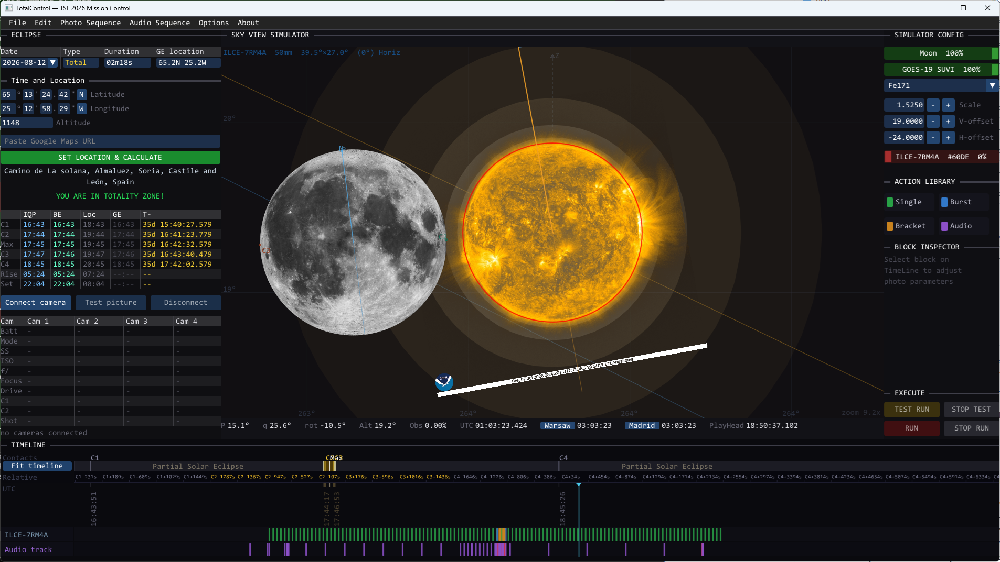

# TotalControl

Windows software built to control Sony Alpha series cameras — via Sony's official
Camera Remote SDK — for planning and executing the perfect solar eclipse photography
sequence, in both space and time.

**Watch the intro video:** [https://youtu.be/rhCX8FMtpQg](https://youtu.be/rhCX8FMtpQg)



Built for the total solar eclipse of **August 12, 2026** (Burgos/Lerma, Spain —
totality 103.9s), but usable for any total eclipse.

## What it does

TotalControl addresses the two determining factors in eclipse photography:
**timing** and **composition**.

- **Automatic local contact times.** From a Google Maps URL of the
  observation site, TotalControl computes the local time of each eclipse
  phase (C1–C4) at that location.
- **Multi-camera control.** Up to four cameras, each independently
  controlled via Sony's Camera Remote SDK.
- **Pre-planned timeline.** Every shot is composed in advance in one of
  three modes — single frame, burst, or bracketing sequence. Each block
  defines shutter speed, ISO, and aperture, and fires at its scheduled
  time.
- **Auto-generated sequences.** Baseline sequences (e.g. a one-frame-per-
  minute time-lapse for the partial phase, or a full bracketing sequence
  for totality) are generated automatically and can then be edited,
  reordered, or extended.
- **Earthshine calibration.** Times the long-exposure Earthshine shot
  (~10–15s or longer) to the exact midpoint of totality, when the corona
  is symmetric. The surrounding bracketing sequence maximizes frame count
  around third contact for Baily's beads and the diamond ring.
- **Voice-guided totality.** An optional spoken-cue audio track for the
  totality sequence, generated automatically from the timeline.
- **Sky View Simulator.** Renders the expected sky from the observation
  viewpoint, matching each camera's focal length, pointing angle, and
  tracking target — e.g. a long lens tracking the Sun (including
  solar-equator rotation) alongside a wide/fisheye camera framing horizon
  and landscape.
- **Live feed overlay.** Overlays each connected camera's live feed onto
  the simulated sky, so framing, leveling, and tracking can be verified
  and corrected on-site before totality.
- **Corona orientation matching.** Since the corona's shape reflects solar
  wind activity from the preceding hours to days, the simulator can be
  rotated to match the currently observed corona orientation for accurate
  framing.

## License & support

TotalControl is **open source**, released under the **GNU GPLv3** license
(see [LICENSE](LICENSE)) — completely free, no paywall, no license to buy.
Development is supported entirely through voluntary donations on Patronite.
If the project is useful to you, that's the only way to support it, and it's
entirely optional.

## Community testing — help needed before August 1, 2026

TotalControl is built on Sony's Camera Remote SDK, so in theory every Sony
Alpha camera it supports should work — but every camera body behaves
slightly differently, and the only way to catch compatibility issues and
edge cases is real people with real Alpha bodies actually running this
software before eclipse day.

**If you own a Sony Alpha camera and are even remotely considering
TotalControl for Spain or any future eclipse — please get involved now.**
Try it, break it, tell us what doesn't work.

**Hard deadline: feedback needs to arrive by August 1, 2026.** After that
date development is fully absorbed into final eclipse preparations, and no
further fixes will land before Spain. If you find something, don't sit on
it — the earlier it's reported, the more likely it gets fixed in time.

## Supported camera models

Per Sony Camera Remote SDK **v2.02.00** compatibility list (update your
camera to the latest firmware before use):

- Alpha 1 II (ILCE-1M2), Alpha 1 (ILCE-1)
- Alpha 9 III (ILCE-9M3), Alpha 9 II (ILCE-9M2)
- Alpha 7R VI (ILCE-7RM6), Alpha 7R V (ILCE-7RM5), Alpha 7R IVA (ILCE-7RM4A), Alpha 7R IV (ILCE-7RM4)
- Alpha 7CR (ILCE-7CR), Alpha 7C II (ILCE-7CM2), Alpha 7C (ILCE-7C)
- Alpha 7S III (ILCE-7SM3)
- Alpha 7 V (ILCE-7M5), Alpha 7 IV (ILCE-7M4)
- Alpha 6700 (ILCE-6700)
- ZV-E1, ZV-E10 II (ZV-E10M2)
- ILX-LR1
- FX6 (ILME-FX6V / ILME-FX6T, firmware v3.00+), FX3A (ILME-FX3A), FX3 (ILME-FX3, firmware v2.00+), FX2 (ILME-FX2), FX30 (ILME-FX30)
- BURANO (MPC-2610)
- ILME-FR7
- PXW-Z300 / PXW-Z380, PXW-Z200 / HXR-NX800
- BRC-AM7
- RX1R III (DSC-RX1RM3), RX0 II (DSC-RX0M2, firmware v3.00+)

Development and testing is centered on the **Alpha 7R IVA (ILCE-7RM4A)**.

## Requirements

### To use (pre-built release)

- Windows 10/11 x64
- A Sony Alpha camera supported by the Camera Remote SDK
- The USB driver included in the release package (`Driver/`) — nothing else
  to install, see `Driver/INSTALL.md`

### To build from source / modify the code

- Windows 10/11 x64
- CMake 4.3.3+
- MSVC (Visual Studio 2026 / VS 18)
- Sony Camera Remote SDK (CrSDK) — see `external/CrSDK/`
- A Sony Alpha camera supported by the Camera Remote SDK

## Build

```cmd
VsDevCmd.bat -arch=amd64
cmake -B out/build/x64-Release -S . -G Ninja -DCMAKE_BUILD_TYPE=Release
cmake --build out/build/x64-Release
```

See [CLAUDE.md](CLAUDE.md) for full architecture, pipe protocol, and
development details.

## Download

Pre-built releases (GUI + server + CLI + camera USB driver) are available
under [Releases](../../releases).

## Acknowledgements

Local and eclipse contact time calculations are powered by
[besselianelements.com](https://www.besselianelements.com/) — many thanks
for providing the API this project relies on.
